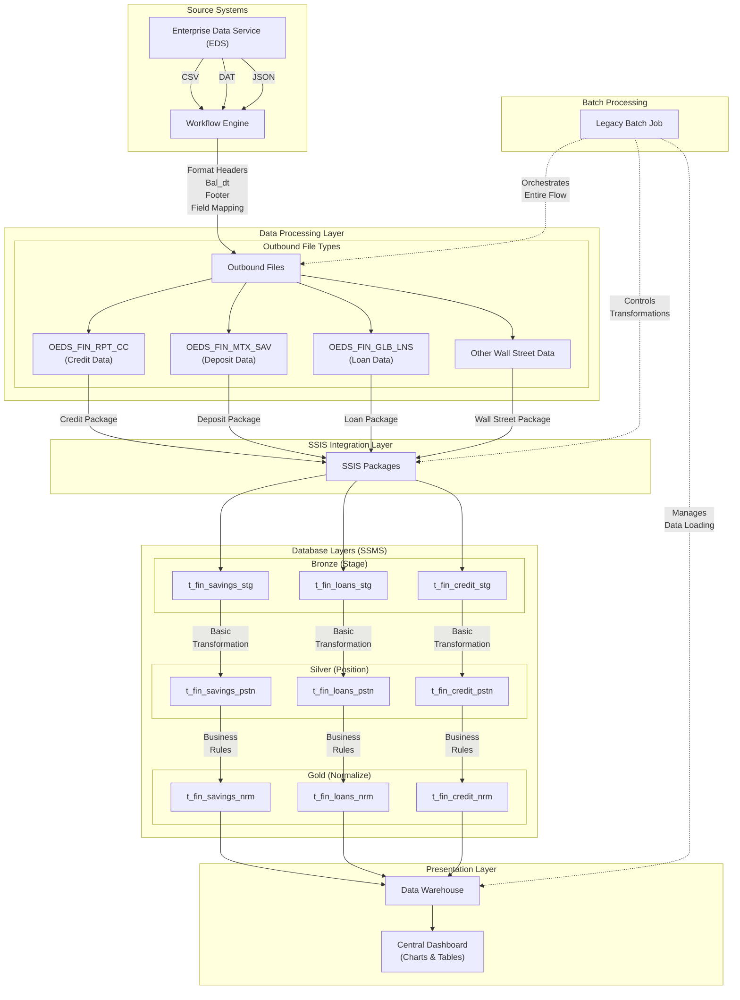
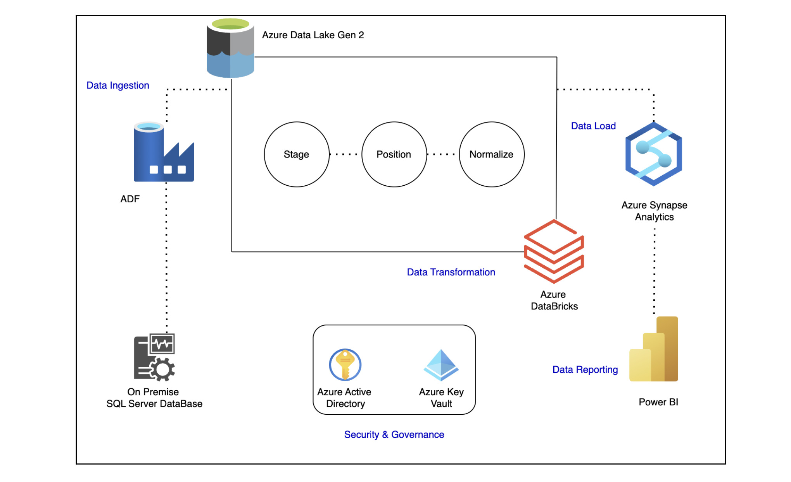
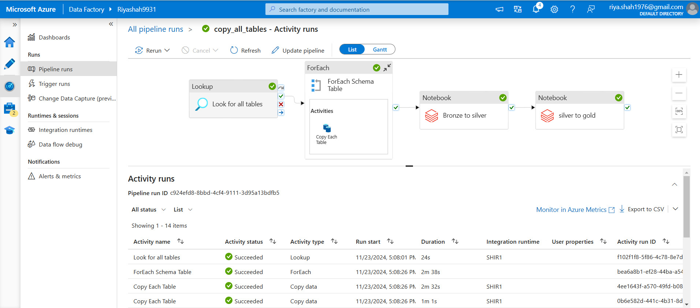

# 🌉 **CloudBridge**

## 📄 **Project Overview**  
CloudBridge is a modernization initiative aimed at migrating from a legacy on-premises database architecture to a cloud-native solution on Azure. This transformation leverages cloud capabilities to enhance **scalability**, **performance**, and **maintainability** while addressing the limitations of the legacy infrastructure.

## 🎯 **Purpose**  
This modernization initiative addresses key business needs:  

- **🔧 Reduce Development Overhead**: Minimize manual interventions, SSIS package maintenance, and transformation rule implementation.  
- **📈 Improve Scalability**: Overcome the limitations of handling increasing data volumes and concurrent processing requirements.  
- **🛠 Enhance Maintainability**: Simplify updates and reduce complexities from multiple technology stacks.  
- **⏩ Accelerate Development Cycles**: Streamline workflows to speed up feature delivery and reduce time-to-market.  

## 🏗 **Architecture**  

### 🔙 **Legacy System**  

The legacy system was based on:  
- On-premises SQL Server (SSMS)  
- Data workflows implemented using SSIS  
- A complex multi-layered architecture  

### 🌐 **CloudBridge Solution**  

CloudBridge adopts Azure’s **cloud-native services** to achieve:  
- Automated, scalable data pipelines  
- Enhanced performance using Databricks and Synapse Analytics  
- Streamlined architecture  

> [!IMPORTANT]  
> For detailed implementation please checkout [implementation guide](implementation/implementation.md)

## ⚖ **Legacy vs. CloudBridge**  

### ⚠️ **Challenges with Legacy Architecture**  

| **Aspect**            | **Legacy System**                              | **Impact**                      |
|------------------------|-----------------------------------------------|----------------------------------|
| Development Time       | 3 weeks per feature                           | Slow delivery cycles            |
| Resource Utilization   | 30 developers for maintenance                 | High operational costs          |
| Technology Stack       | EDS → SSIS → SSMS → Web UI                    | Complex maintenance             |
| Data Processing        | Manual transformations, error-prone           | Delays and reliability issues   |
| Scalability            | Limited by on-premises infrastructure         | Performance bottlenecks         |

### 🌟 **Benefits of CloudBridge**  

| **Aspect**            | **Modern System**                              | **Impact**                      |
|------------------------|-----------------------------------------------|----------------------------------|
| Development Time       | Automated processes, minimal manual effort    | Faster feature delivery         |
| Resource Utilization   | Optimized team size                           | Reduced operational costs       |
| Technology Stack       | Azure-native tools (ADF, Databricks, Synapse) | Simplified maintenance          |
| Data Processing        | Automated pipelines using PySpark             | Improved reliability            |
| Scalability            | Elastic cloud scaling                         | Enhanced performance            |

## 🔄 **Data Flow**  

1. **📥 Raw Data Ingestion**: Data from EDS is stored in **SSMS**.  
2. **🔄 Data Movement**: Azure Data Factory orchestrates transfer to **Azure Data Lake**.  
3. **⚙️ Data Transformation**: Databricks notebooks process data using **PySpark**.  
4. **📂 Storage**: Processed data is stored in **Azure Synapse Analytics**.  
5. **📊 Visualization**: Power BI provides analytics and reporting.  

## 🛠 **Technologies Used**  

### ☁️ **Cloud Platform**  
- **Azure Cloud**: Core platform hosting all services.  

### 🗂 **Data Storage & Processing**  
- **Azure Data Factory**: Data integration service.  
- **Azure Data Lake**: Tiered data storage (Bronze, Silver, Gold).  
- **Azure Synapse Analytics**: Scalable analytics service.  
- **Azure Databricks**: Big data processing platform.  

### 🔄 **Data Integration & Transformation**  
- **PySpark**: Engine for scalable data processing.  
- **Databricks Notebooks**: Development environment for transformation logic.  

### 📊 **Visualization & Reporting**  
- **Power BI**: BI and visualization platform.  

### 📡 **Source System**  
- **Enterprise Data Service (EDS)**: Primary raw data source.

](https://youtu.be/Oj2W-znvzIg?si=ICEFk05uFgJivTNG)