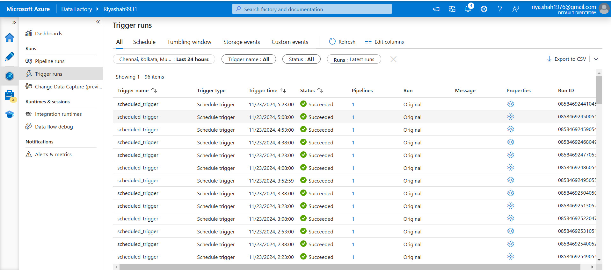

## 🚀 Data Ingestion  

In this project, we leveraged **Azure Data Factory (ADF)** to source data from **SQL Server Management Studio (SSMS)** into the Azure cloud. The ingested data is stored in containers, which are further utilized in subsequent stages of the pipeline.  

## 👨‍💻 **Tasks Overview**  

### **Containers**  
We created three containers to structure the data, each storing information in **Parquet file format**:  
- **Bronze Container**: Contains raw data imported directly from SSMS.  
- **Silver Container**: Holds data with minimal transformations applied to the Bronze layer.  
- **Gold Container**: Contains highly refined and fully transformed data sourced from the Silver layer.  

### **Pipelines**  
A robust pipeline was built to streamline the data ingestion process.  
- The pipeline extracts data from SSMS tables as the source.  
- It applies a **lookup operation** for each table.  
- The processed data is then ingested into the specified folder paths within the containers, stored in **Parquet format**.  

This setup ensures an efficient and organized approach to data handling, paving the way for seamless transformation and analysis in the cloud.

## 📸 Snapshots

