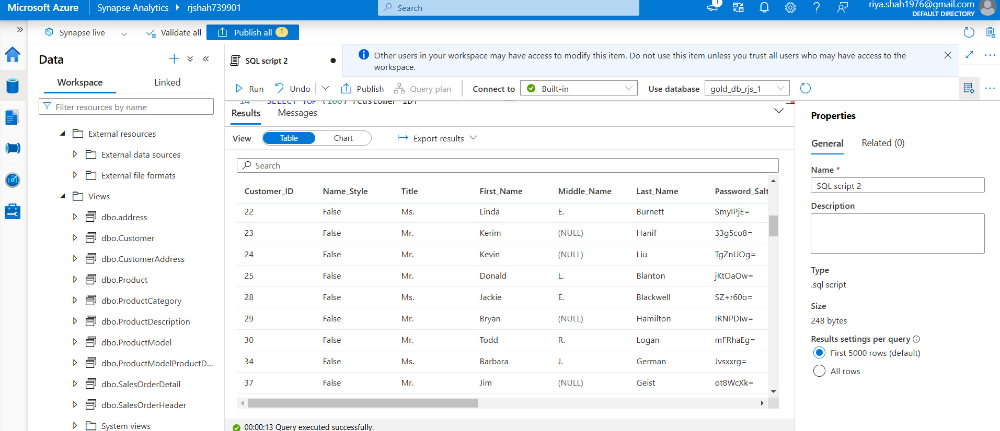

## 🚀 Data Load

We utilized **Synapse Analytics** to create views on top of the data stored in the **Gold container** within the data warehouse. These views dynamically reflect the latest data as new records arrive in the container, ensuring real-time updates when results are fetched. 

In this context, the views do not store physical data; instead, they act as a virtual representation or an abstraction layer over the container's data.
## 👨‍💻 **Tasks Overview** 

To simplify and automate the process, we developed a **stored procedure** that iterates through all the tables stored in the containers and creates views based on the data. This is achieved by establishing a direct connection to the containers, ensuring seamless integration and efficient view creation.

## 📸 Snapshots

