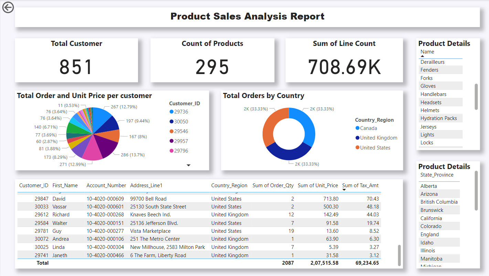

## 🚀 Data Reporting

In this section, we designed a **Power BI report** to provide analytics and insights derived from the final output data. The report includes an interactive toolbar, allowing users to select a specific value and dynamically update all visuals to display corresponding results.

## 👨‍💻 **Tasks Overview** 

We created three types of visuals in the report:  

- **Table**: Displays detailed information about product sales, customers, and addresses based on dynamically selected product values.  
- **Pie Chart and Donut Chart**: Visualize the total units of products sold, categorized by region and country.  
- **Number Bars**: Highlight key metrics, including the total number of customers, product sales, and related details.  

## 📸 Snapshots

