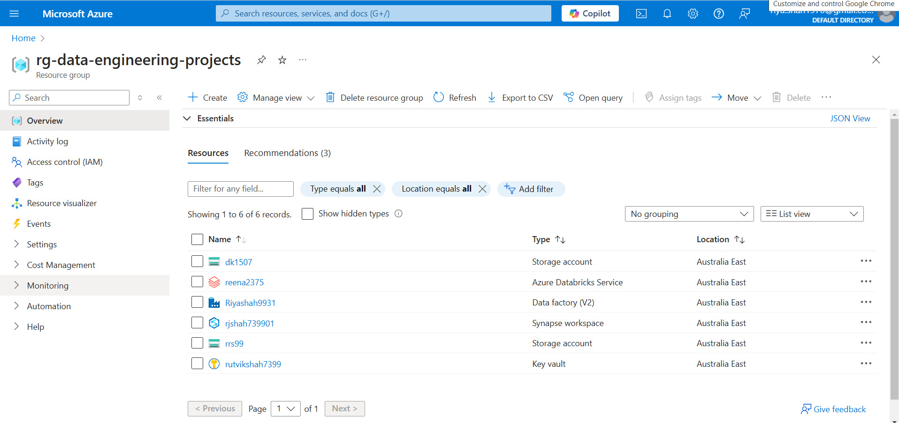

## 🚀 Resourse Setup

We have established the foundational prerequisites required to execute the project.

## 👨‍💻 **Tasks Overview** 

- **Data**: Open-source data provided by Microsoft Azure was utilized for this project.  
- **Microsoft Integration Runtime**: Used to establish a communication channel between the local SSMS server and Azure Data Factory (ADF).  
- **Resource Group**: A resource group was created in Azure to serve as a centralized hub for resources, enabling shared access and seamless integration.  

## 📸 Snapshots

